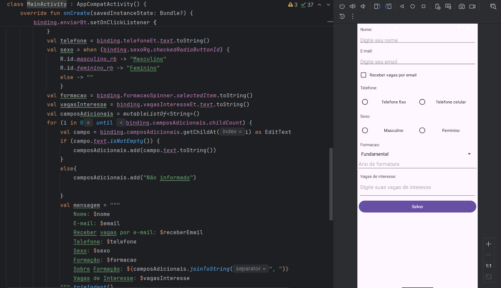

# 💼 HaVagas — App de Cadastro para Oportunidades de Emprego  
Aplicativo Android desenvolvido para cadastrar usuários interessados em vagas de trabalho, com campos dinâmicos e validação de dados.



---

## 🙋‍♀️ Sobre o projeto

Esse app foi desenvolvido como parte da disciplina **Programação para Dispositivos Móveis** no **IFSP - São Carlos**.  
O objetivo foi aplicar conceitos de interface, lógica condicional e manipulação de componentes visuais com Kotlin.

---

## ✨ O que ele faz

- Cadastro completo com nome, e-mail, telefone, sexo e formação  
- Campos adicionais dinâmicos conforme o nível de formação selecionado  
- Identificação do tipo de telefone (fixo ou celular) com exibição condicional  
- Checkbox para receber vagas por e-mail  
- Campo aberto para vagas de interesse  
- Botão de envio que exibe os dados preenchidos em um `AlertDialog`  
- Botão para limpar os campos (implementação opcional)

---

## ⚙️ Tecnologias usadas

- **Kotlin** — linguagem principal  
- **ViewBinding** — para facilitar a ligação entre layout e código  
- **Componentes de UI do Android** — como `EditText`, `RadioGroup`, `Spinner`, `CheckBox`, `AlertDialog`, entre outros

---

## 📂 Estrutura básica

Toda a lógica está na `MainActivity.kt`.  
A função `criarCampo(hint: String)` é usada para gerar dinamicamente os campos adicionais de acordo com a formação selecionada no `Spinner`.  
O botão de envio (`enviarBt`) coleta os dados dos campos e exibe um resumo em um `AlertDialog`.

---

## 🧪 Como testar

1. Clone o repositório:  
   ```bash
   git clone https://github.com/seu-usuario/havagas-app.git
